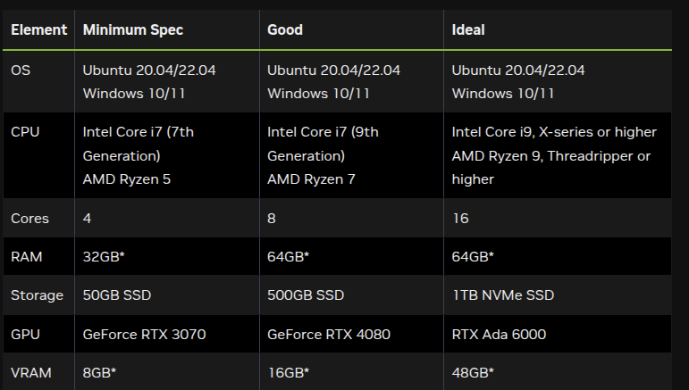

# H1 Locomotion: Standalone IsaacLab Extension for Unitree H1 on Rough Terrain


---

## Overview

This repository is a **standalone extension based on IsaacLab** for simulating and training locomotion of the Unitree H1 humanoid robot in rough terrain. It leverages IsaacLab's modular, manager-based environment design, enabling advanced reinforcement learning (RL) workflows and flexible robot control.

**Key Features:**
- Standalone, modular extension for IsaacLab
- Focused on Unitree H1 humanoid locomotion in challenging environments
- Manager-based environment design for easy customization and RL integration
- Ready-to-use RL training and evaluation scripts

---

## Installation

### 1. System Requirements

> **System Requirements:**  
> Please review the [IsaacLab System Requirements](https://isaac-sim.github.io/IsaacLab/main/source/setup/installation/index.html) to ensure your system is compatible.



### 2. Install Isaac Sim

Follow the official [Isaac Sim installation guide](https://docs.isaacsim.omniverse.nvidia.com/latest/installation/quick-install.html).

### 3. Install IsaacLab

Follow the [IsaacLab installation guide](https://isaac-sim.github.io/IsaacLab/main/source/setup/installation/index.html).  
Conda installation is recommended for ease of use.

### 4. Install this Extension

Clone this repository **outside** your IsaacLab directory, then install in editable mode:

```bash
python -m pip install -e source/h1_locomotion
```

---

## Manager-Based Environments

Environments in IsaacLab bring together different aspects of the simulation—such as the scene, observation and action spaces, and reset events—to create a coherent interface for various applications.  
Manager-based environments are implemented as `envs.ManagerBasedEnv` and `envs.ManagerBasedRLEnv` classes.  
- `ManagerBasedRLEnv` is tailored for RL tasks and includes rewards, terminations, curriculum, and command generation.
- `ManagerBasedEnv` is for traditional robot control and does not include RL-specific features.

Learn more in the [IsaacLab Manager-Based Environment Tutorial](https://isaac-sim.github.io/IsaacLab/main/source/tutorials/03_envs/create_manager_base_env.html).

---

## Quick Start

### 1. List Available Environments

```bash
python scripts/list_envs.py
```

### 2. Train a Policy

Example (RSL-RL, 4096 environments, headless):

```bash
python3 scripts/rsl_rl/train.py --task Template-H1-Locomotion-v0 --num_envs 4096 --headless
```

### 3. Play a Trained Policy

```bash
python3 scripts/rsl_rl/play.py --task Template-H1-Locomotion-Play-v0 --num_envs 16 
```

---

## Author

Niraj Pudasaini  
nirajpudasaini13@gmail.com
